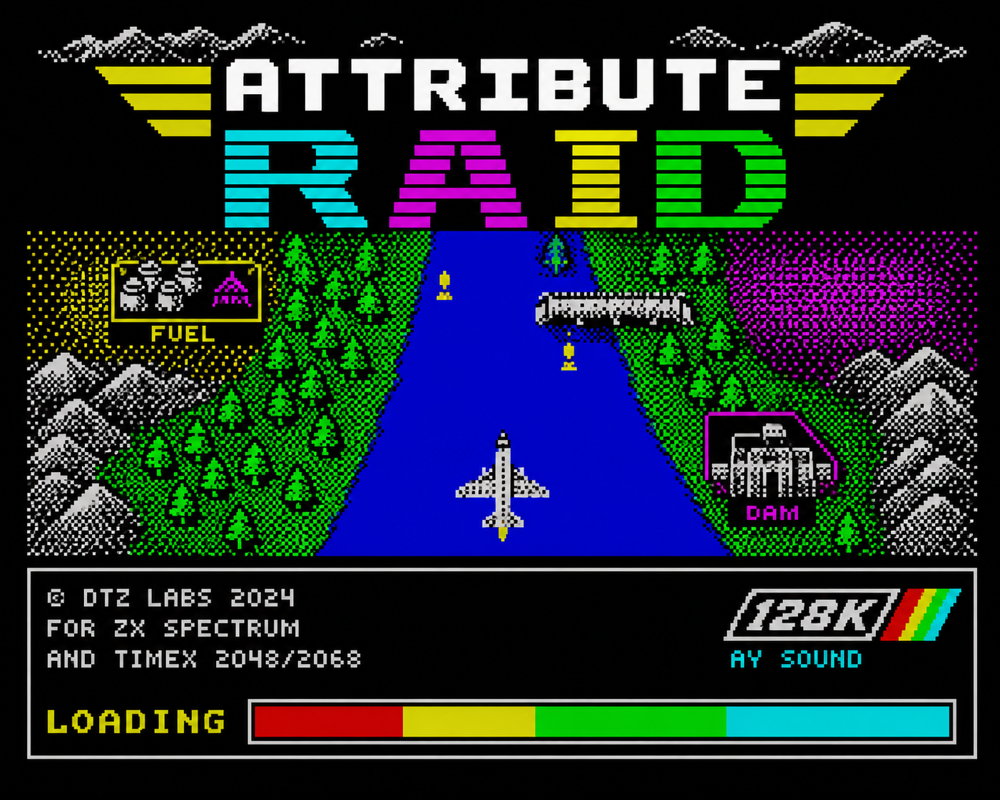

# Attribute Raid

Attribute Raid is a River Raid-style prototype with a ZX Spectrum 48K-compatible
renderer and optional AY-3-8912 sound for the Spectrum 128K or a 48K machine
with an AY interface. All code executed on the Spectrum is well-commented Z80
assembly; there is no C runtime. A dedicated build uses the Timex TC2048/TC2068/
TS2068 graphics modes: its 8×1 hi-colour screen gives every scanline its own
colour pair instead of the Spectrum's 8×8 attribute cells.

The sound effects, the sprites, and the sprite colours are unapologetically
"stolen" from the Atari 2600 original: they were transcribed from Thomas
Jentzsch's commented disassembly of River Raid (Activision, 1982), archived at
<https://web.archive.org/web/20230404092047/http://www.bjars.com/source/RiverRaid.asm>
(originally `bjars.com/source/RiverRaid.asm`). Only derived register values
and shapes are reproduced here, no original code.



The loading screen above (`assets/loading-screen.png`) ships in both TAPs as a
`SCREEN$` block, converted to the Spectrum's 6912-byte format in
`assets/loading-screen.scr` and displayed while the code block loads.

**Status:** `0.3.0` is a beta release. The core gameplay is playable, but level
progression and final balancing are not complete yet: aircraft controls, two
speed modifiers, firing, collisions, two lives, fuel and refuelling, a crash
animation, scoring, AY sound, and a `GAME OVER` screen are in place.

## Building and running

```sh
make              # build both TAPs, no external Z80 toolchain required
make run          # ZEsarUX as a Spectrum 128K with AY sound
make run-timex    # ZEsarUX as a TC2068: 8x1 hi-colour plus native AY
```

The default build produces two files:

- `build/attribute-raid.tap` for the ZX Spectrum 48K/128K,
- `build/attribute-raid-timex.tap` for the Timex TC2048/TC2068/TS2068
  hi-colour mode.

All remaining targets (profiling builds, per-model emulator runs, joystick
configuration) are described in [docs/building.md](docs/building.md).

## Controls

- `O` / `P` — move the player aircraft left / right at 2 px per frame,
- no speed key — base scrolling speed of 1 px per frame,
- hold `Q` — fast scrolling: a flat 2 px per frame in every scene,
- hold `A` — temporarily reduce scrolling to an average of 0.5 px per frame,
- `SPACE` — fire,
- `R` — start a new game with two lives, a zero score, and a new course.

The Kempston joystick supports left/right, FIRE, and temporary speed changes.
Up is equivalent to `Q`, and down is equivalent to `A`. After loading, the game
waits at a small start screen until SPACE or Kempston FIRE is pressed. After
the second life is lost, release FIRE before pressing it again to start a new
game; this prevents the `GAME OVER` screen from being skipped accidentally.

## Documentation

- [docs/building.md](docs/building.md) — every make target, the emulator
  configuration, the built-in assembler/toolchain, and the module layout.
- [docs/timex.md](docs/timex.md) — the Timex 8×1 hi-colour mode and the
  TC2048/TC2068/TS2068 AY hardware handling, including the optional-AY probe.
- [docs/renderer.md](docs/renderer.md) — the V3 course model, the incremental
  renderer, colour/bridge/sprite handling, and the performance budget.
- [docs/gameplay.md](docs/gameplay.md) — collision rules, HUD, fuel, tanks,
  bridges, and scoring details.
- [docs/sound.md](docs/sound.md) — the Atari-derived AY effects and the
  TIA-to-AY conversion pipeline.
- [CHANGELOG.md](CHANGELOG.md) — release history.
